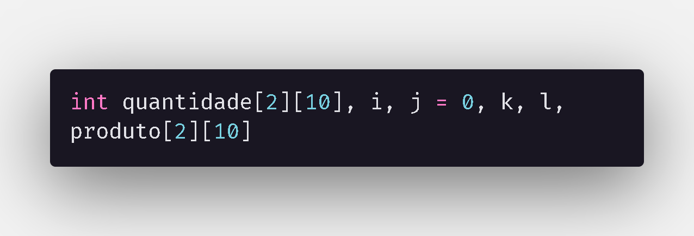
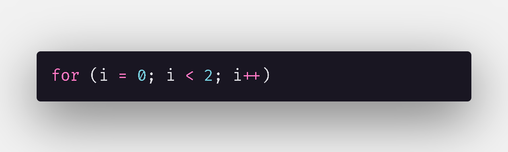
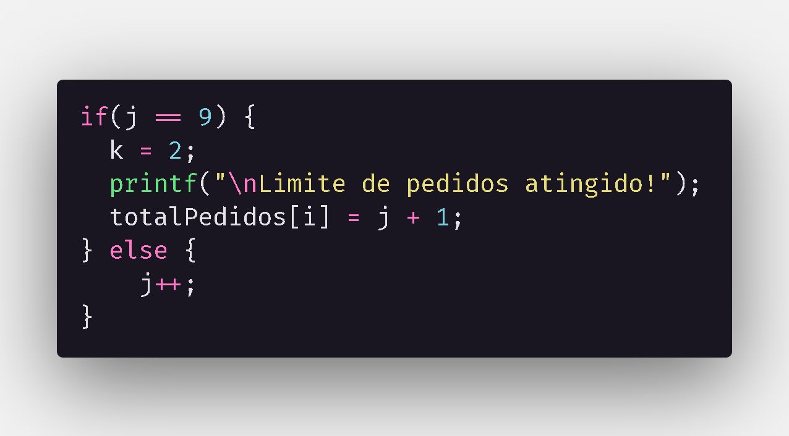
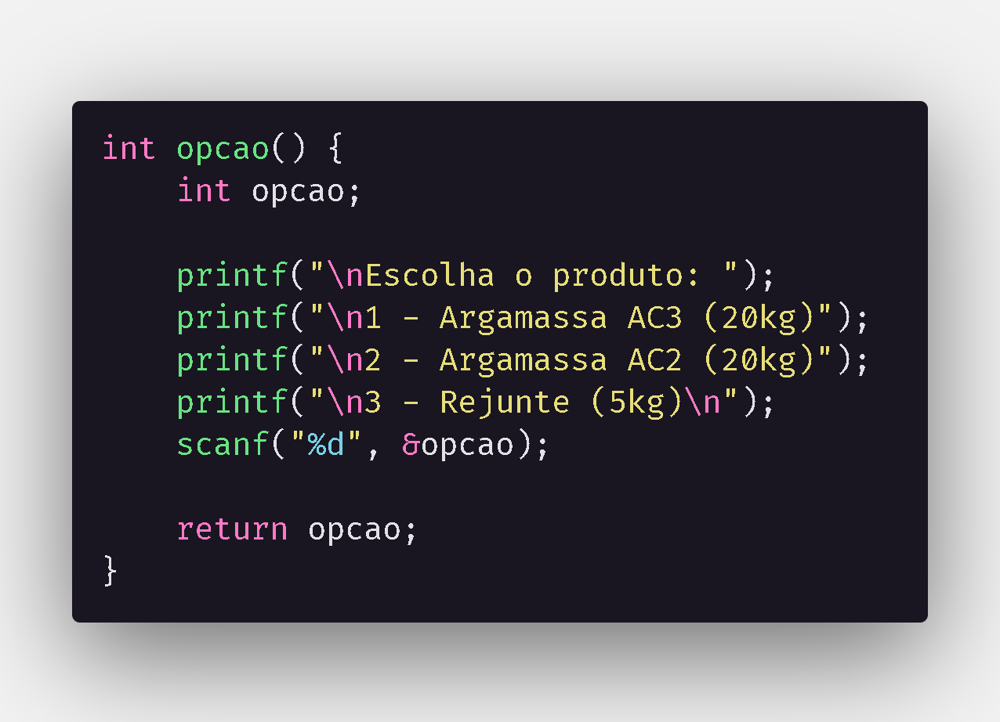
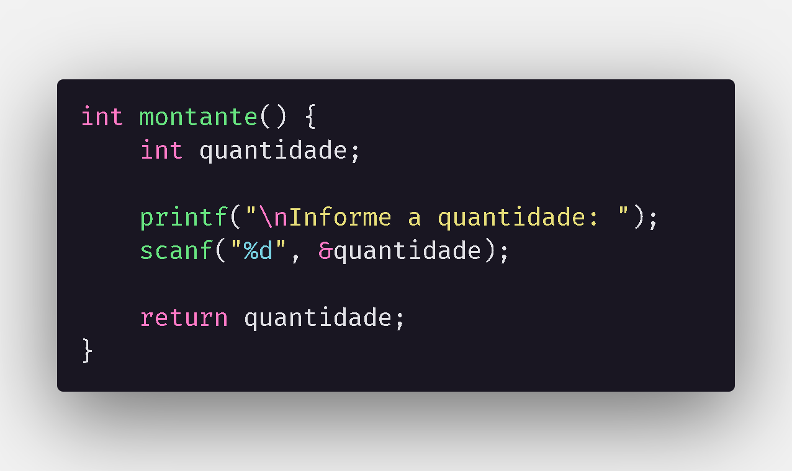
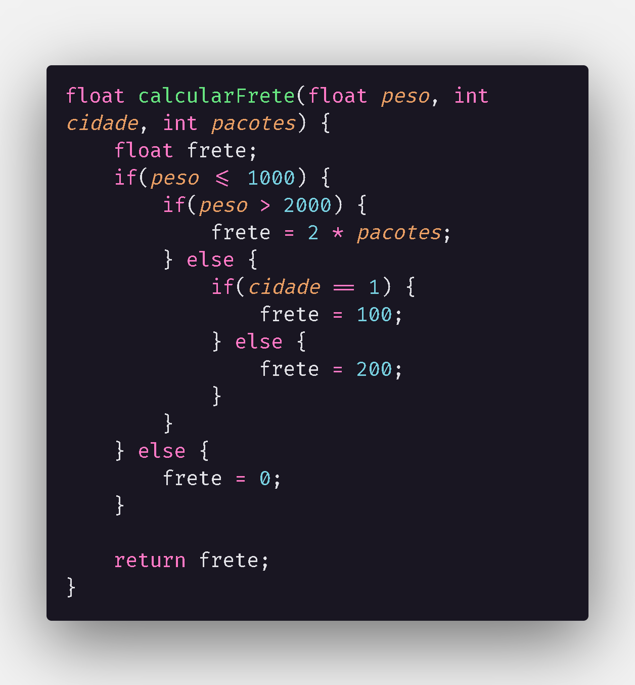
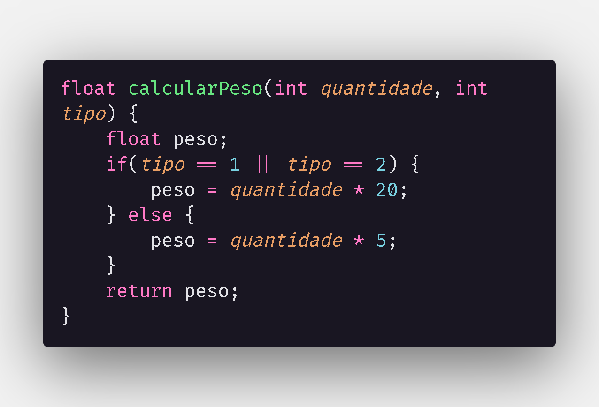

<h1>Desafio</h1>
Uma fábrica de argamassas vende 3 produtos: argamassa AC3 20kg, argamassa AC2 20kg e rejunte
5kg. Suas entregas são feitas em Palmas ou Porto Nacional. Durante o último ano, esta fábrica manteve registros de pedidos de 2 grandes clientes. Cada cliente fez um número indeterminado de pedidos (no máximo 10), sendo que cada pedido tem o tipo do produto, a quantidade de pacotes e a localidade da entrega.
Faça um programa em Linguagem C que leia os dados dos pedidos de cada cliente e imprima um
dos seguintes relatórios:
- [x] Relatório por pedido: dado o número do cliente e do pedido, mostre o tipo e a quantidade do
produto, a localidade e o valor do frete;
- [x] Relatório por cliente: dado o número do cliente mostre a média de peso dos seus pedidos e o
número de pedidos feitos no período;
- [x] Relatório geral: mostre quantos kg de material foram vendidos no período e quais pedidos
tem menos de 1000kg;
- [x] Após imprimir um relatório, deve ser possível ao usuário imprimir outro caso queira;

Obs.: 
* Cálculo do frete: Se o pedido tem menos que 1000kg, o frete é grátis. Se tem de 1001kg a 2000kg, o
frete é R$ 100,00 para Palmas e 200,00 para Porto Nacional. Se tiver mais que 2000kg, o valor do
frete será 2 reais por pacote.

<h2>Etapas de resolução</h2>

<h4>1. Matrizes e laços</h4>
As matrizes (unidimensionais e bidimensionais) e laços de repetição utilizados para guardar os valores de entrada de cada cliente na "mesma variável".

Utilizando a imagem como exemplo, em <b>quantidade[2][10]</b>, o número de posições da <i>"Dimensão 1"</i> da matriz se refere ao número de clientes, no caso 2, e o número de posições da <i>"Dimensão 2"</i>, no caso 10, se refere ao número máximo de pedidos que os clientes podem fazer.

As variáveis <b>i, j e k</b> são utilizadas dentro dos laços de repetição, sendo:
- i = Cliente atual

- j = Pedido atual

Dentro do laço while, controlado pela variável <b>k</b>, a variável <b>j</b> é usada para determinar o número de pedidos já realizados e o pedido atual.
- k = Controle do laço while

<h4>2. Funções</h4>
Além da função principal "main", são usadas 4 outras funções:

<h5>2.1: Opção</h5>

Como o próprio nome sugere, esta função é utilizada para selecionar o produto durante os pedidos.
<h5>2.2: Montante</h5>

Utilizada para informar a quantidade do produto selecionado no pedido em específico.

<h5>2.3: Calcular Frete</h5>

Utilizada para calcular o frete baseado no peso (referente ao pedido), cidade e número de pacotes(quantidade).

<h5>2.4: Calcular Peso</h5>

Calcula o peso baseado na quantidade e no tipo de produto (referente ao pedido).
